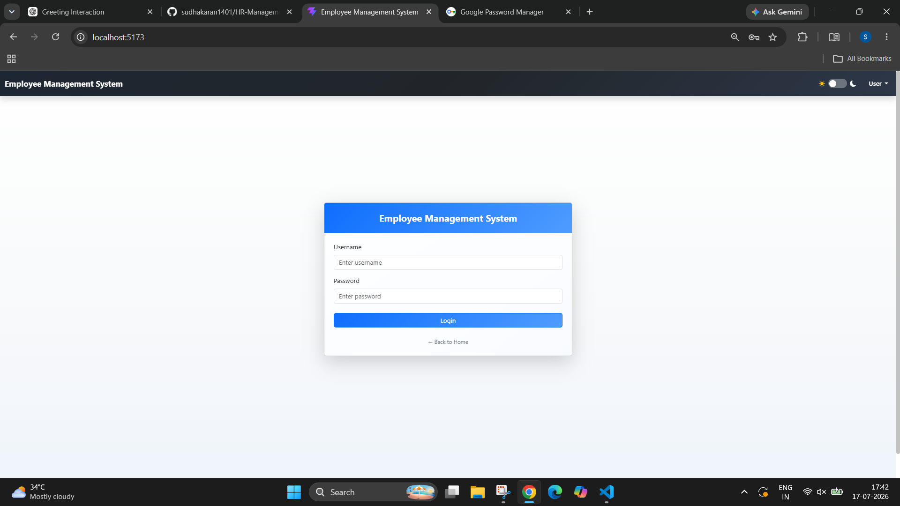
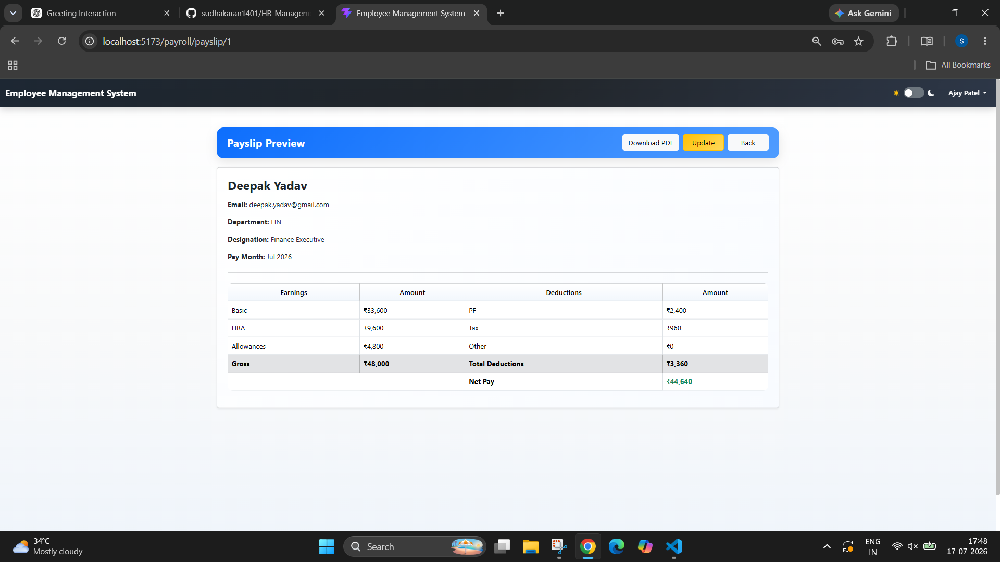
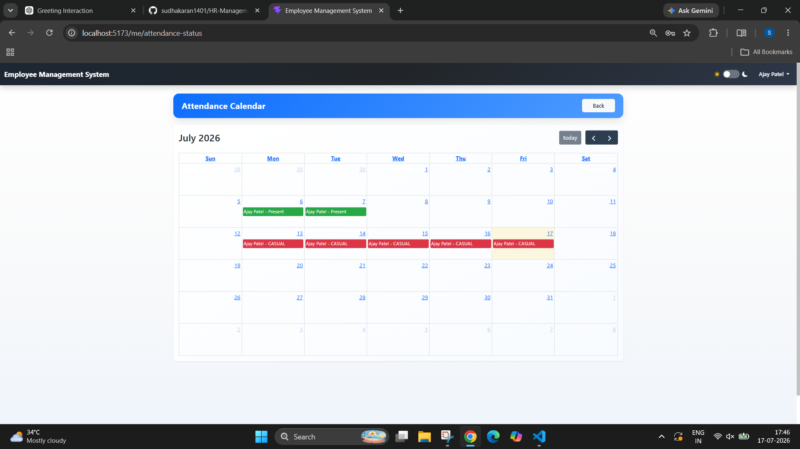
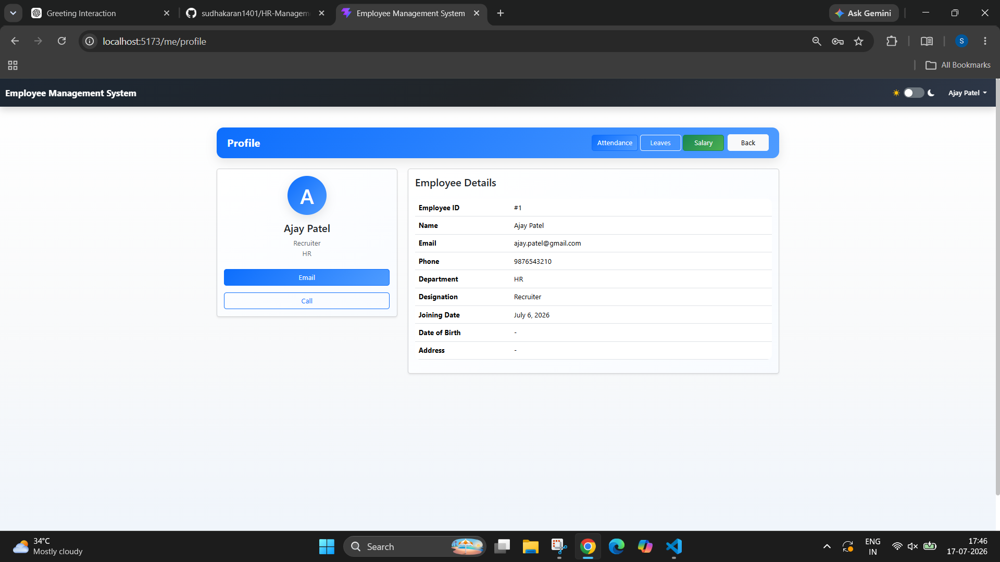

# 🏢 HR Management System

<p align="center">


</p>

---

# 📖 Overview

The **HR Management System** is a secure, full-stack web application developed using **React**, **Django REST Framework**, **JWT Authentication**, and **MySQL** to automate and simplify daily Human Resource operations.

The application provides separate dashboards for **HR Administrators** and **Employees**, ensuring secure role-based access to employee information, attendance management, leave management, payroll processing, reports, calendars, and profile management.

The system minimizes manual paperwork, improves data accuracy, and provides a centralized platform for managing organizational HR activities.

---

# ✨ Features

## 🔐 Authentication

- Secure Login
- JWT Authentication
- Role-Based Authorization
- Protected REST APIs
- Secure Logout

---

## 👨‍💼 Employee Management (HR)

- Add Employee
- Update Employee
- Delete Employee
- Employee Directory
- Employee Details
- Employee Reports

---

## 🕒 Attendance Management

### HR

- Mark Attendance
- Update Attendance
- Attendance List
- Attendance Report

### Employee

- Mark Daily Attendance
- View Attendance History

---

## 📝 Leave Management

### HR

- View Leave Requests
- Approve Leave
- Reject Leave
- Leave Reports

### Employee

- Apply Leave
- Update Leave Request
- Leave History

---

## 💰 Payroll Management

### HR

- Generate Payroll
- Update Payroll
- Payroll List
- Payroll Reports
- Generate Payslip

### Employee

- View Payroll History
- View Payslip
- Download Payslip

---

## 📊 Dashboards

### HR Dashboard

- Employee Statistics
- Attendance Summary
- Leave Summary
- Payroll Summary

### Employee Dashboard

- Attendance Overview
- Leave Overview
- Payroll Overview
- Quick Access Modules

---

## 📄 Reports

- Employee Report
- Attendance Report
- Leave Report
- Payroll Report

---

## 📅 Calendar

- Attendance Calendar
- Leave Calendar

---

## 👤 Profile

- View Profile
- Update Profile

---

## 🌙 User Interface

- Responsive Design
- Modern UI
- Bootstrap Components
- Dark Theme
- Mobile Friendly

---

# 🖼️ Application Screenshots

## Login

<p align="center">

</p>

---

## HR Dashboard

<p align="center">

</p>

---

## Employee Dashboard

<p align="center">

</p>

---

## Employee Management

<p align="center">

</p>

<p align="center">

</p>

<p align="center">

</p>

---

## Attendance Management

<p align="center">

</p>

<p align="center">

</p>

<p align="center">

</p>

---

## Leave Management

<p align="center">

</p>

<p align="center">

</p>

---

## Payroll Management

<p align="center">

</p>

<p align="center">

</p>

<p align="center">

</p>

<p align="center">

</p>

---

## Calendar

<p align="center">

</p>

---

## Request Dashboard

<p align="center">

</p>

<p align="center">

</p>

---

## Profile

<p align="center">

</p>

---

## Dark Theme

<p align="center">

</p>

---

# ⚙️ Technology Stack

## Frontend

- React 18
- Vite
- Bootstrap 5
- Axios
- React Router
- HTML5
- CSS3
- JavaScript (ES6+)

## Backend

- Python 3.12+
- Django 6.x
- Django REST Framework
- JWT Authentication
- WhiteNoise
- Gunicorn

## Database

- MySQL

## Development Tools

- Git
- GitHub
- VS Code
- Postman

---

# 🔄 System Workflow

```text
                     START
                       │
                       ▼
              User Opens Application
                       │
                       ▼
                  Login Page
                       │
                       ▼
            Username & Password
                       │
                       ▼
             JWT Authentication
                       │
         ┌─────────────┴─────────────┐
         ▼                           ▼
   HR Administrator             Employee
         │                           │
         ▼                           ▼
   HR Dashboard             Employee Dashboard
         │                           │
         ├── Employee Management     ├── Attendance
         ├── Attendance              ├── Leave
         ├── Leave                   ├── Payroll
         ├── Payroll                 ├── Calendar
         ├── Reports                 ├── Profile
         ├── Calendar                │
         └── Profile                 │
                       │
                       ▼
                    Logout
                       │
                       ▼
                      END
```

---

# 🏗️ System Architecture

```text
               React Frontend
                      │
                      ▼
           Axios HTTP Requests
                      │
                      ▼
          JWT Authentication Layer
                      │
                      ▼
        Django REST Framework APIs
                      │
                      ▼
              Business Logic Layer
                      │
        ├── Accounts Module
        ├── Dashboard Module
        ├── Employees Module
        ├── Attendance Module
        ├── Leave Module
        ├── Payroll Module
        └── Reports Module
                      │
                      ▼
               MySQL Database
```

---

# 📂 Project Structure

```text
HR-Management-System/
│
├── backend/
│   ├── accounts/
│   ├── attendance/
│   ├── dashboard/
│   ├── employees/
│   ├── leave/
│   ├── payroll/
│   ├── reports/
│   ├── config/
│   ├── media/
│   ├── static/
│   ├── templates/
│   ├── manage.py
│   ├── requirements.txt
│   ├── Procfile
│   ├── .env.example
│   └── .gitignore
│
├── frontend/
│   ├── public/
│   ├── src/
│   ├── package.json
│   ├── vite.config.js
│   └── .env.example
│
├── images/
├── README.md
└── .gitignore
```

---
# ⚙️ Installation

## Prerequisites

Before running the project, ensure you have the following installed:

- Python 3.12+
- Node.js 18+
- npm
- MySQL 8+
- Git

---

## Clone Repository

```bash
git clone https://github.com/sudhakaran1401/HR-Management-System.git

cd HR-Management-System
```

---

# 🐍 Backend Setup

Navigate to the backend folder.

```bash
cd backend
```

## Create Virtual Environment

### Windows

```bash
python -m venv venv

venv\Scripts\activate
```

### Linux / macOS

```bash
python3 -m venv venv

source venv/bin/activate
```

---

## Install Dependencies

```bash
pip install -r requirements.txt
```

---

## Configure Environment Variables

Copy the example environment file.

### Windows

```cmd
copy .env.example .env
```

### Linux / macOS

```bash
cp .env.example .env
```

Open `.env` and configure the following values.

```env
SECRET_KEY=your_secret_key

DEBUG=True

ALLOWED_HOSTS=127.0.0.1,localhost

DB_ENGINE=django.db.backends.mysql
DB_NAME=HRMS
DB_USER=root
DB_PASSWORD=your_password
DB_HOST=localhost
DB_PORT=3306

CORS_ALLOWED_ORIGINS=http://localhost:5173
CSRF_TRUSTED_ORIGINS=http://localhost:5173

SESSION_COOKIE_SECURE=False
CSRF_COOKIE_SECURE=False

EMAIL_BACKEND=django.core.mail.backends.smtp.EmailBackend
EMAIL_HOST=smtp.gmail.com
EMAIL_PORT=587
EMAIL_HOST_USER=your_email@gmail.com
EMAIL_HOST_PASSWORD=your_gmail_app_password
EMAIL_USE_TLS=True
EMAIL_USE_SSL=False
DEFAULT_FROM_EMAIL=your_email@gmail.com
```

---

## Apply Database Migrations

```bash
python manage.py makemigrations

python manage.py migrate
```

---

## Create Superuser

```bash
python manage.py createsuperuser
```

---

## Collect Static Files

```bash
python manage.py collectstatic --noinput
```

---

## Run Backend

```bash
python manage.py runserver
```

Backend URL

```
http://127.0.0.1:8000/
```

---

# ⚛️ Frontend Setup

Open another terminal.

```bash
cd frontend
```

Install dependencies.

```bash
npm install
```

Run the development server.

```bash
npm run dev
```

Frontend URL

```
http://localhost:5173
```

---

# 🚀 Production Deployment

## Backend

Start Gunicorn.

```bash
gunicorn config.wsgi:application
```

Or using the Procfile.

```text
web: gunicorn config.wsgi:application
```

---

## Environment Variables

Set the following variables on your hosting platform.

```env
DEBUG=False

ALLOWED_HOSTS=your-domain.com

CORS_ALLOWED_ORIGINS=https://your-frontend-domain.com

CSRF_TRUSTED_ORIGINS=https://your-frontend-domain.com

SESSION_COOKIE_SECURE=True

CSRF_COOKIE_SECURE=True

SECURE_SSL_REDIRECT=True

SECURE_HSTS_SECONDS=31536000

SECURE_HSTS_INCLUDE_SUBDOMAINS=True

SECURE_HSTS_PRELOAD=True
```

---

## Supported Platforms

- Railway
- Render
- Koyeb
- AWS
- Azure
- DigitalOcean
- Hostinger VPS
- Ubuntu VPS (Nginx + Gunicorn)

---

# 📖 API Documentation

After running the backend, the API documentation is available at:

### Swagger UI

```
http://127.0.0.1:8000/api/schema/swagger-ui/
```

### ReDoc

```
http://127.0.0.1:8000/api/schema/redoc/
```

### OpenAPI Schema

```
http://127.0.0.1:8000/api/schema/
```

---

# 📦 Core Modules

## 👨‍💼 Employee Management

- Add Employee
- Update Employee
- Delete Employee
- Employee Directory
- Employee Reports

---

## 🕒 Attendance Management

### HR

- Mark Attendance
- Attendance Reports
- Attendance History

### Employee

- Daily Attendance
- Attendance History

---

## 📝 Leave Management

### HR

- View Leave Requests
- Approve Leave
- Reject Leave
- Leave Reports

### Employee

- Apply Leave
- Update Leave
- Leave History

---

## 💰 Payroll Management

### HR

- Generate Payroll
- Update Payroll
- Payroll Reports
- Generate Payslip

### Employee

- Payroll History
- View Payslip
- Download Payslip

---

## 📊 Dashboard

- HR Dashboard
- Employee Dashboard
- Request Dashboard

---

## 📅 Calendar

- Attendance Calendar
- Leave Calendar

---

## 👤 Profile

- View Profile
- Update Profile

---

## 📄 Reports

- Employee Reports
- Attendance Reports
- Leave Reports
- Payroll Reports

---

# 🔐 Security

The application implements multiple security mechanisms.

- JWT Authentication
- Role-Based Authorization
- Protected REST APIs
- Password Hashing
- CSRF Protection
- CORS Protection
- Secure Cookies
- WhiteNoise Static File Serving
- Environment Variable Configuration

---

# 📈 Future Enhancements

- Email Notifications
- Real-Time Notifications
- Biometric Attendance Integration
- Docker Support
- Kubernetes Deployment
- AWS Deployment
- Azure Deployment
- Mobile Application
- AI-powered HR Analytics

---

# 👨‍💻 Author

## Sudha Karan

**Python Full Stack Developer**

GitHub

```
https://github.com/sudhakaran1401
```

---

# 📄 License

This project is licensed under the **MIT License**.

You are free to use, modify, and distribute this project in accordance with the terms of the MIT License.

---

# ⭐ Support

If you found this project useful:

- ⭐ Star this repository
- 🍴 Fork the repository
- 🐛 Report issues
- 💡 Submit feature requests
- 🤝 Contribute improvements

Your support helps improve the project and makes it more discoverable.

---

# 🙏 Acknowledgements

Special thanks to the open-source community and the developers behind:

- Django
- Django REST Framework
- React
- Vite
- Bootstrap
- MySQL
- Gunicorn
- WhiteNoise

---

**Thank you for checking out the HR Management System!**