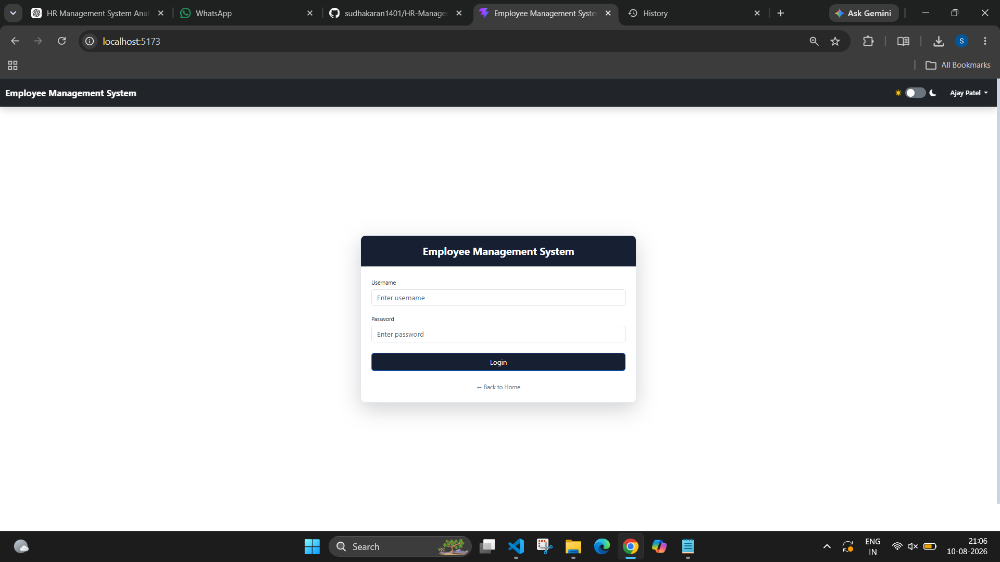
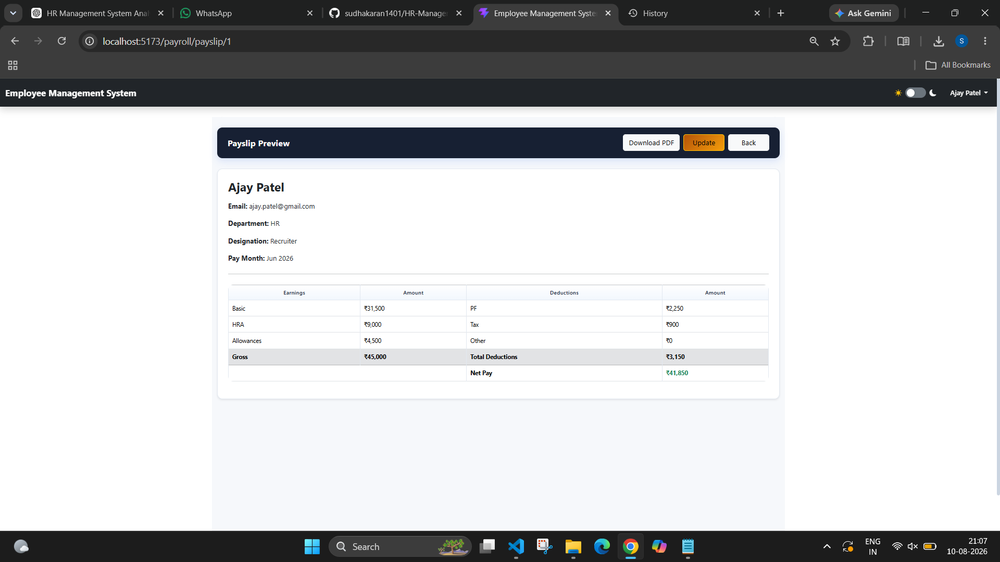
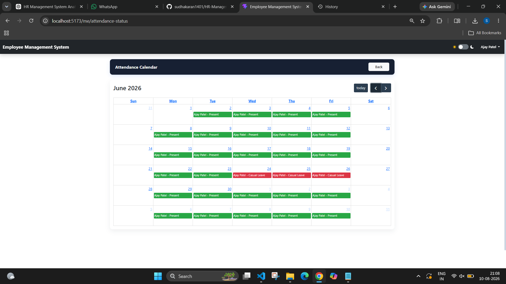
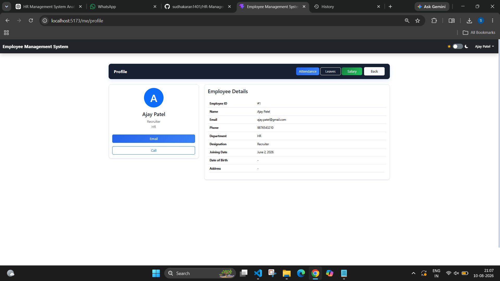

# 🏢 HR Management System

<p align="center">


</p>

---

# 📖 Overview

The **HR Management System (HRMS)** is a full-stack web application built with **React**, **Django REST Framework**, **JWT authentication**, and **MySQL** to simplify and centralize common Human Resource operations.

The system provides separate experiences for **HR/Admin users** and **Employees**, with role-based access to employee records, attendance, leave requests, payroll, reports, calendars, dashboards, and profile management.

The application is designed to reduce manual HR work, improve data consistency, provide useful reporting, and give employees self-service access to their HR information.

---

# ✨ Features

## 🔐 Authentication & Authorization

- Secure login
- JWT access and refresh tokens
- Session authentication for Django/REST framework administration
- Role-based access control
- Protected frontend routes
- Protected REST APIs
- HR/Admin and Employee access levels
- Secure logout
- Configurable token lifetimes

---

## 👨‍💼 Employee Management

### HR/Admin

- Add employees
- Update employee information
- Delete employees
- Employee directory
- Employee profile management
- Employee reports
- Bulk employee import from Excel

### Employee

- View personal employee information
- View profile
- Update profile information where permitted

---

## 🕒 Attendance Management

### HR/Admin

- Mark attendance
- Update attendance
- View attendance records
- Search/filter attendance
- Attendance reports
- Attendance data export
- Bulk attendance import from Excel

### Employee

- Mark daily attendance
- View attendance history
- View attendance calendar

---

## 📝 Leave Management

### HR/Admin

- View leave requests
- Review leave requests
- Approve leave
- Reject leave
- View leave history
- Leave reports
- Leave data export
- Bulk leave import from Excel

### Employee

- Apply for leave
- Update eligible leave requests
- View leave history + leave balance
- Track request status

---

## 💰 Payroll Management

### HR/Admin

- Create payroll records
- Update payroll
- View payroll list
- Search/filter payroll
- Payroll reports
- Generate payslips
- Export payroll data
- Bulk payroll import from Excel

### Employee

- View payroll history
- View payslip
- Download payslip

---

## 📊 Dashboards

### HR Dashboard

- Employee statistics
- Attendance summary
- Leave summary
- Payroll summary
- KPI cards
- Charts and visual summaries
- Quick access to reports 

### Employee Dashboard

- Attendance overview
- Leave overview
- Payroll overview
- Profile information

---

## 📄 Reports & Exports

The system includes report pages and export functionality for major HR modules.

- Employee reports
- Attendance reports
- Leave reports
- Payroll reports
- Report filtering
- Report summaries
- Chart-based report visualization
- PDF/report downloads where supported
- Excel/data exports where supported

The backend uses libraries such as **ReportLab**, **Pandas**, and **OpenPyXL** for document and spreadsheet-related processing.

---

## 📥 Excel Data Import

Bulk data can be imported through Django management commands.

Available import commands include:

```bash
python manage.py import_employees
python manage.py import_attendance
python manage.py import_leaves
python manage.py import_salary
```

Sample Excel files are included in the backend directory for development/testing:

```text
backend/attendance_data.xlsx
backend/employee_full_dept.xlsx
backend/leave_data.xlsx
backend/salary_data.xlsx
```

---

## 👤 Profile

- View profile
- Update profile
- Employee profile association
- Role-aware profile access

---

## 🌙 User Interface

- Responsive design
- Bootstrap 5 components
- Dark theme
- Mobile-friendly layouts
- Reusable React components
- Loading states
- Alerts and error handling
- Search and pagination
- Charts and dashboard visualizations
- Bootstrap Icons and Lucide icons

---

# 🖼️ Application Screenshots

## Login

<p align="center">

</p>

---

## HR Dashboard

<p align="center">

</p>

---

## Employee Dashboard

<p align="center">

</p>

---

## Employee Management

<p align="center">

</p>

<p align="center">

</p>

<p align="center">

</p>

---

## Attendance Management

<p align="center">

</p>

<p align="center">

</p>

<p align="center">

</p>

---

## Leave Management

<p align="center">

</p>

<p align="center">

</p>

---

## Payroll Management

<p align="center">

</p>

<p align="center">

</p>

<p align="center">

</p>

<p align="center">

</p>

---

## Calendar

<p align="center">

</p>

---

## Request Dashboard

<p align="center">

</p>

<p align="center">

</p>

---

## Profile

<p align="center">

</p>

---

## Dark Theme

<p align="center">

</p>

---

# ⚙️ Technology Stack

## Frontend

- React 19.2.6
- React DOM 19.2.6
- Vite 8.0.12
- React Router DOM 7.11.0
- Bootstrap 5.3.8
- Bootstrap Icons 1.13.1
- Axios 1.18.0
- FullCalendar 6.1.21
- Chart.js 4.5.1
- React Chart.js 2 5.3.1
- Lucide React
- JavaScript ES6+
- HTML5
- CSS3

## Backend

- Python 3.12+
- Django 6.0.2
- Django REST Framework 3.17.1
- Simple JWT 5.5.1
- Django CORS Headers 4.9.0
- Django Filter 25.2
- drf-spectacular 0.29.0
- WhiteNoise 6.12.0
- Gunicorn 26.0.0
- ReportLab 4.5.1
- Pandas 3.0.2
- OpenPyXL 3.1.5

## Database

- MySQL 8.x
- Docker Compose support for MySQL 8.4

## Testing

### Frontend

- Vitest 4.1.10
- React Testing Library
- Testing Library User Event
- JSDOM
- ESLint

### End-to-End

- Playwright 1.62.1
- Chromium
- Firefox
- WebKit
- Axe Playwright accessibility testing

### Backend

- Django test framework
- Unit tests
- Integration tests
- Security tests
- System tests
- Acceptance tests
- Regression tests
- Reliability tests
- Recovery tests

## DevOps

- Git
- GitHub Actions
- Docker
- Docker Buildx
- GitHub Container Registry
- Vercel
- Render

---

# 🔄 System Workflow

```text
                     START
                       │
                       ▼
              User Opens Application
                       │
                       ▼
                  Login Page
                       │
                       ▼
            Username & Password
                       │
                       ▼
             JWT Authentication
                       │
         ┌─────────────┴─────────────┐
         ▼                           ▼
   HR Administrator             Employee
         │                           │
         ▼                           ▼
   HR Dashboard             Employee Dashboard
         │                           │
         ├── Employee Management     ├── Attendance
         ├── Attendance              ├── Leave
         ├── Leave                   ├── Payroll
         ├── Payroll                 ├── Calendar
         ├── Reports                 └── Profile
         ├── Calendar
         └── Profile
                       │
                       ▼
                    Logout
                       │
                       ▼
                      END
```

---

# 🏗️ System Architecture

```text
                         React Frontend
                               │
                               ▼
                       Axios HTTP Client
                               │
                               ▼
                     JWT Authentication
                               │
                               ▼
                    Django REST Framework
                               │
             ┌─────────────────┴─────────────────┐
             │                                   │
             ▼                                   ▼
       API Endpoints                         Django Views
             │                                   │
             └─────────────────┬─────────────────┘
                               ▼
                       Business Logic
                               │
          ┌────────┬───────────┼───────────┬──────────┐
          ▼        ▼           ▼           ▼          ▼
      Accounts  Employees  Attendance    Leave      Payroll
          │        │           │           │          │
          └────────┴───────────┴───────────┴──────────┘
                               │
                               ▼
                         MySQL Database
```

---

# 📂 Project Structure

```text
HR-Management-System/
│
├── .github/
│   └── workflows/
│       ├── ci.yml
│       ├── cd.yml
│       └── docker-ci.yml
│
├── backend/
│   ├── accounts/
│   ├── attendance/
│   ├── dashboard/
│   ├── employees/
│   ├── leave/
│   ├── payroll/
│   ├── config/
│   ├── tests/
│   │   ├── acceptance/
│   │   ├── recovery/
│   │   ├── regression/
│   │   ├── reliability/
│   │   └── system/
│   ├── media/
│   ├── static/
│   ├── templates/
│   ├── attendance_data.xlsx
│   ├── employee_full_dept.xlsx
│   ├── leave_data.xlsx
│   ├── salary_data.xlsx
│   ├── e2e_seed.py
│   ├── manage.py
│   ├── requirements.txt
│   ├── Dockerfile
│   ├── Procfile
│   └── runtime.txt
│
├── frontend/
│   ├── public/
│   ├── src/
│   │   ├── components/
│   │   ├── config/
│   │   ├── hooks/
│   │   ├── layouts/
│   │   ├── pages/
│   │   ├── services/
│   │   ├── assets/
│   │   ├── App.jsx
│   │   ├── App.css
│   │   └── main.jsx
│   ├── package.json
│   ├── package-lock.json
│   ├── Dockerfile
│   ├── nginx.conf
│   └── vercel.json
│
├── testing/
│   ├── e2e/
│   ├── package.json
│   ├── package-lock.json
│   └── playwright.config.js
│
├── images/
├── docker-compose.yml
├── README.md
└── .gitignore
```

---

# ⚙️ Installation

## Prerequisites

For local development, install:

- Python 3.12+
- Node.js 20+
- npm
- MySQL 8+
- Git

Docker users can run the application without installing MySQL locally.

> The backend Docker image is based on Python 3.13, and `backend/runtime.txt` specifies Python 3.13.6. The GitHub Actions backend CI currently uses Python 3.12.

---

# 📥 Clone Repository

```bash
git clone https://github.com/sudhakaran1401/HR-Management-System.git

cd HR-Management-System
```

---

# 🐍 Backend Setup

Navigate to the backend directory:

```bash
cd backend
```

## Create Virtual Environment

### Windows

```bash
python -m venv venv

venv\Scripts\activate
```

### Linux / macOS

```bash
python3 -m venv venv

source venv/bin/activate
```

---

## Install Backend Dependencies

```bash
pip install --upgrade pip
pip install -r requirements.txt
```

---

# 🔐 Backend Environment Variables

The repository does not currently include a `backend/.env.example` file. Create `backend/.env` manually.

A local MySQL configuration can look like:

```env
SECRET_KEY=change-this-in-development
DEBUG=True

ALLOWED_HOSTS=127.0.0.1,localhost

DB_ENGINE=django.db.backends.mysql
DB_NAME=HRMS
DB_USER=root
DB_PASSWORD=your_mysql_password
DB_HOST=localhost
DB_PORT=3306

CORS_ALLOWED_ORIGINS=http://localhost:5173
CSRF_TRUSTED_ORIGINS=http://localhost:5173

SESSION_COOKIE_SECURE=False
CSRF_COOKIE_SECURE=False

EMAIL_BACKEND=django.core.mail.backends.smtp.EmailBackend
EMAIL_HOST=smtp.gmail.com
EMAIL_PORT=587
EMAIL_HOST_USER=your_email@gmail.com
EMAIL_HOST_PASSWORD=your_app_password
EMAIL_USE_TLS=True
EMAIL_USE_SSL=False
DEFAULT_FROM_EMAIL=your_email@gmail.com
```

### Important

Do not commit real secrets, database passwords, email credentials, or production tokens to Git.

For production, also configure the security-related variables used by Django:

```env
SECURE_SSL_REDIRECT=True
SECURE_HSTS_SECONDS=31536000
SECURE_HSTS_INCLUDE_SUBDOMAINS=True
SECURE_HSTS_PRELOAD=True
SESSION_COOKIE_SECURE=True
CSRF_COOKIE_SECURE=True
```

Use these production settings only when the deployment is correctly configured for HTTPS.

---

# 🗄️ Database Setup

Create a MySQL database that matches `DB_NAME`.

For example:

```sql
CREATE DATABASE HRMS;
```

Then apply migrations:

```bash
python manage.py makemigrations
python manage.py migrate
```

---

# 👤 Create an Admin User

Create a Django superuser:

```bash
python manage.py createsuperuser
```

The Django administration interface is available at:

```text
http://127.0.0.1:8000/admin/
```

---

# 📦 Optional: Seed/Test Data

The repository includes an E2E seed script:

```bash
python e2e_seed.py
```

This script creates/updates test HR and Employee users and related sample records for end-to-end testing.

The seed script contains test credentials intended for automated testing. Do not use those credentials as production accounts.

---

# 📥 Import Sample Excel Data

The backend contains management commands for bulk importing HR data.

Examples:

```bash
python manage.py import_employees
python manage.py import_attendance
python manage.py import_leaves
python manage.py import_salary
```

Sample files are included under `backend/`.

Before importing custom files, inspect the corresponding management command to confirm the expected input columns and file location.

---

# ▶️ Run Backend

Start Django:

```bash
python manage.py runserver
```

Backend:

```text
http://127.0.0.1:8000/
```

---

# ⚛️ Frontend Setup

Open a second terminal and navigate to the frontend:

```bash
cd frontend
```

Install dependencies:

```bash
npm install
```

Run the development server:

```bash
npm run dev
```

Frontend:

```text
http://localhost:5173
```

The frontend reads the API URL through `VITE_API_URL` when configured by the Vite environment/build setup.

For a local `.env` file in `frontend/`, you can use:

```env
VITE_API_URL=http://127.0.0.1:8000
```

---

# 🧪 Testing

The project includes backend tests, frontend tests, and Playwright end-to-end tests.

---

## Backend Tests

From `backend/`:

```bash
python manage.py test
```

### System Tests

```bash
python manage.py test tests.system
```

### Acceptance Tests

```bash
python manage.py test tests.acceptance
```

### Regression Tests

```bash
python manage.py test tests.regression
```

### Reliability Tests

```bash
python manage.py test tests.reliability
```

### Recovery Tests

```bash
python manage.py test tests.recovery
```

The backend also contains module-level tests and integration/security test files inside the individual Django applications.

---

## Frontend Unit & Component Tests

From `frontend/`:

```bash
npm install
npm test
```

Run linting:

```bash
npm run lint
```

Create a production build:

```bash
npm run build
```

---

## End-to-End Tests

The E2E testing project is located in:

```text
testing/
```

Install its dependencies:

```bash
cd testing
npm install
```

Install Playwright browsers:

```bash
npx playwright install
```

Run the Playwright test suite:

```bash
npx playwright test
```

The project is configured for browser-based testing and includes accessibility checks through Axe Playwright.

---

# 📚 API Documentation

The project uses **drf-spectacular** for OpenAPI schema generation and Swagger UI.

## OpenAPI Schema

```text
http://127.0.0.1:8000/api/schema/
```

## Swagger UI

```text
http://127.0.0.1:8000/api/docs/
```


---

# 🔌 API Overview

Major API areas include:

```text
/api/
/api/token/
/api/token/refresh/
/api/employees/
/api/attendance/
/api/leave/
/api/payroll/
/api/dashboard/
```

The exact endpoints, request bodies, query parameters, authentication requirements, and response schemas are available through Swagger UI.

---

# 🔑 Authentication

JWT authentication is provided through Simple JWT.

## Obtain Token

```http
POST /api/token/
```

## Refresh Token

```http
POST /api/token/refresh/
```

The API uses authenticated access by default, with role/permission checks applied by individual views and services.

---

# 🐳 Docker

Docker Compose is provided for running:

- MySQL 8.4
- Django backend
- React/Nginx frontend

## Docker Services

| Service | Container | Host Port |
|---|---|---:|
| MySQL | `hrms_mysql` | `3307` |
| Backend | `hrms_backend` | `8000` |
| Frontend | `hrms_frontend` | `3000` |

---

## Configure Backend `.env`

Docker Compose expects:

```text
backend/.env
```

because the backend service contains:

```text
env_file:
  - ./backend/.env
```

For the included Docker MySQL service, use database values matching the Compose configuration:

```env
SECRET_KEY=change-this-for-local-docker
DEBUG=True

ALLOWED_HOSTS=127.0.0.1,localhost

DB_ENGINE=django.db.backends.mysql
DB_NAME=hrms
DB_USER=hrms_user
DB_PASSWORD=hrms_password
DB_HOST=mysql
DB_PORT=3306

CORS_ALLOWED_ORIGINS=http://localhost:3000,http://localhost:5173
CSRF_TRUSTED_ORIGINS=http://localhost:3000,http://localhost:5173

SESSION_COOKIE_SECURE=False
CSRF_COOKIE_SECURE=False

EMAIL_BACKEND=django.core.mail.backends.smtp.EmailBackend
EMAIL_HOST=localhost
EMAIL_PORT=587
EMAIL_HOST_USER=
EMAIL_HOST_PASSWORD=
EMAIL_USE_TLS=True
EMAIL_USE_SSL=False
DEFAULT_FROM_EMAIL=noreply@hrms.local
```

---

## Start Docker Compose

From the project root:

```bash
docker compose up --build
```

Frontend:

```text
http://localhost:3000
```

Backend:

```text
http://localhost:8000
```

MySQL is exposed to the host on:

```text
localhost:3307
```

Stop the services:

```bash
docker compose down
```

Stop services and remove the database volume:

```bash
docker compose down -v
```

---

# 🏭 Production Build

## Frontend

Build the React application:

```bash
cd frontend
npm run build
```

Preview the production build locally:

```bash
npm run preview
```

The frontend Docker image uses a multi-stage build and serves the generated application through Nginx.

---

## Backend

Collect static files:

```bash
cd backend
python manage.py collectstatic --noinput
```

Run with Gunicorn:

```bash
gunicorn config.wsgi:application
```

The repository also contains:

```text
backend/Procfile
```

with the Gunicorn web process.

---

# 🌐 Live Deployment

## Frontend

🔗 https://hr-management-system-6trp.vercel.app/

The live React application is deployed on Vercel.

## Backend API

🔗 https://hrms-backend-sha-8649275.onrender.com/

The Django REST Framework backend is deployed on Render.

## API Documentation

🔗 https://hrms-backend-sha-8649275.onrender.com/api/docs/

Swagger UI provides interactive API documentation.

## OpenAPI Schema

🔗 https://hrms-backend-sha-8649275.onrender.com/api/schema/

The OpenAPI schema is generated using drf-spectacular.

---

# ☁️ Deployment

The repository's CI/CD configuration is designed around:

```text
Frontend → Vercel
Backend  → Render
Database → Managed MySQL / deployment provider
```

The automated deployment workflow is defined in:

```text
.github/workflows/cd.yml
```

The workflow:

1. Waits for successful CI.
2. Builds the frontend.
3. Deploys the frontend to Vercel.
4. Triggers the backend deployment on Render.
5. Checks the production frontend URL.
6. Checks the production backend URL.

---

## Vercel Configuration

The frontend includes:

```text
frontend/vercel.json
```

with a rewrite that routes application requests to `index.html`, supporting React client-side routing.

The deployment workflow expects these GitHub Actions secrets:

```text
VERCEL_TOKEN
VERCEL_ORG_ID
VERCEL_PROJECT_ID
PRODUCTION_FRONTEND_URL
PRODUCTION_BACKEND_URL
RENDER_DEPLOY_HOOK_URL
```

Configure these secrets in the GitHub repository before enabling automated deployment.

---

# 🔁 CI/CD

The repository contains three GitHub Actions workflows:

```text
.github/workflows/ci.yml
.github/workflows/cd.yml
.github/workflows/docker-ci.yml
```

---

## Continuous Integration

`ci.yml` runs on pushes and pull requests targeting `main`.

The CI pipeline covers:

### Backend

- Dependency installation
- Django system checks
- Static collection
- Django tests
- System tests
- Acceptance tests
- Regression tests
- Reliability tests
- Recovery tests

### Frontend

- Node.js setup
- Dependency installation
- Frontend build/lint/test checks defined by the workflow

---

## Continuous Deployment

`cd.yml` runs after a successful `HRMS CI` workflow on `main`.

It deploys:

```text
Frontend → Vercel
Backend  → Render
```

and performs production health checks using the configured frontend/backend URLs.

---

## Docker CI

`docker-ci.yml` builds Docker images for:

```text
hrms-backend
hrms-frontend
```

The workflow uses:

```text
GitHub Container Registry (GHCR)
```

and publishes images for non-pull-request builds.

---

# 🔒 Security

The backend includes several security-related controls.

## Authentication

- JWT authentication
- Django session authentication
- Protected API endpoints
- Configurable access token lifetime
- Configurable refresh token lifetime

## HTTP Security

- HTTPS redirect support
- HSTS configuration
- Secure cookies for production
- HTTP-only session cookies
- SameSite cookie configuration
- Content type sniffing protection
- Clickjacking protection
- Proxy-aware HTTPS configuration

## API Security

- Authenticated REST APIs by default
- Role/permission checks
- CORS configuration
- CSRF trusted-origin configuration
- Django password validation
- Search/filter/order support through DRF and Django Filter

---

# 🧰 Useful Django Commands

From `backend/`:

## Check the project

```bash
python manage.py check
```

## Create migrations

```bash
python manage.py makemigrations
```

## Apply migrations

```bash
python manage.py migrate
```

## Create superuser

```bash
python manage.py createsuperuser
```

## Collect static files

```bash
python manage.py collectstatic --noinput
```

## Run development server

```bash
python manage.py runserver
```

---

# 🧹 Code Quality

Frontend linting:

```bash
cd frontend
npm run lint
```

Backend dependencies include Ruff for Python linting/quality tooling.

---

# 🗃️ Sample Data & Test Accounts

The repository includes sample Excel files for data-import testing and an E2E seed script.

The E2E seed script creates test users for automated browser testing. These credentials are for development/testing only.

If you need a clean development database, it is recommended to:

1. Create the database.
2. Apply migrations.
3. Create a superuser.
4. Run the required seed/import commands.
5. Start the backend and frontend.

---

# 🛠️ Troubleshooting

## Frontend cannot connect to backend

Check:

```env
VITE_API_URL=http://127.0.0.1:8000
```

Also verify that the backend is running and that CORS allows the frontend origin.

---

## CORS error

Check:

```env
CORS_ALLOWED_ORIGINS=http://localhost:5173
```

For Docker:

```env
CORS_ALLOWED_ORIGINS=http://localhost:3000,http://localhost:5173
```

Use the actual origin from which the frontend is being served.

---

## CSRF error

Check:

```env
CSRF_TRUSTED_ORIGINS=http://localhost:5173
```

or the appropriate frontend origin for your environment.

---

## MySQL connection error

Verify:

```env
DB_ENGINE=django.db.backends.mysql
DB_NAME=HRMS
DB_USER=root
DB_PASSWORD=your_password
DB_HOST=localhost
DB_PORT=3306
```

For Docker, the backend must use the Compose service name:

```env
DB_HOST=mysql
DB_PORT=3306
```

The host machine connects to the Docker MySQL service through:

```text
localhost:3307
```

---

## Docker backend starts before MySQL

The Compose configuration includes a MySQL health check and makes the backend depend on the MySQL service becoming healthy.

If the database is being initialized for the first time, allow the container a little time to complete initialization.

---

# 🚀 Typical Development Workflow

```text
1. Clone repository
       │
       ▼
2. Configure backend/.env
       │
       ▼
3. Create/configure MySQL
       │
       ▼
4. Install backend dependencies
       │
       ▼
5. Run migrations
       │
       ▼
6. Create superuser / seed data
       │
       ▼
7. Start Django backend
       │
       ▼
8. Install frontend dependencies
       │
       ▼
9. Start React/Vite frontend
       │
       ▼
10. Open the application
       │
       ▼
11. Run tests before committing
       │
       ▼
12. Push to GitHub
       │
       ▼
13. GitHub Actions runs CI
       │
       ▼
14. Successful main branch build triggers CD
```

---

# 📌 Important URLs

## Local Development

| Resource | URL |
|---|---|
| Frontend | `http://localhost:5173` |
| Backend | `http://127.0.0.1:8000` |
| Django Admin | `http://127.0.0.1:8000/admin/` |
| API Schema | `http://127.0.0.1:8000/api/schema/` |
| Swagger UI | `http://127.0.0.1:8000/api/docs/` |

## Docker

| Resource | URL |
|---|---|
| Frontend | `http://localhost:3000` |
| Backend | `http://localhost:8000` |
| Django Admin | `http://localhost:8000/admin/` |
| Swagger UI | `http://localhost:8000/api/docs/` |
| MySQL | `localhost:3307` |

---

# 📋 Project Modules

The backend is organized into the following major Django applications:

| Module | Responsibility |
|---|---|
| `accounts` | Authentication and user-related functionality |
| `employees` | Employee records and profiles |
| `attendance` | Attendance records, calendars, reports, imports and exports |
| `leave` | Leave requests, balances, calendars, reports and imports |
| `payroll` | Payroll, salary history, payslips, reports and imports |
| `dashboard` | Dashboard KPIs, summaries and visualizations |
| `config` | Django project configuration, settings and URL routing |

---

# 📈 Future Enhancements

Possible future improvements include:

- Email notifications for HR events
- Automated leave notifications
- Payroll notification emails
- More advanced analytics
- Additional employee self-service features
- Expanded audit logging
- More configurable reporting
- Additional deployment environments
- Extended accessibility coverage
- More granular role/permission management

---

# 🤝 Contributing

Contributions are welcome.

## Suggested workflow

```bash
git checkout -b feature/your-feature
```

Make your changes, then run:

```bash
cd backend
python manage.py check
python manage.py test
```

And:

```bash
cd ../frontend
npm run lint
npm test
npm run build
```

For E2E changes:

```bash
cd ../testing
npx playwright test
```

Commit your changes:

```bash
git add .
git commit -m "Add your change"
```

Push the branch:

```bash
git push origin feature/your-feature
```

Then open a pull request.

---

# 📄 License

This project is licensed under the **MIT License**.

See the repository license file for the complete license terms.

---

# 👨‍💻 Author

**Sudhakaran**

GitHub:

https://github.com/sudhakaran1401

---

# ⭐ Support

If you find this project useful, consider giving the repository a ⭐ on GitHub.

For issues or feature requests, open an issue in the repository.
